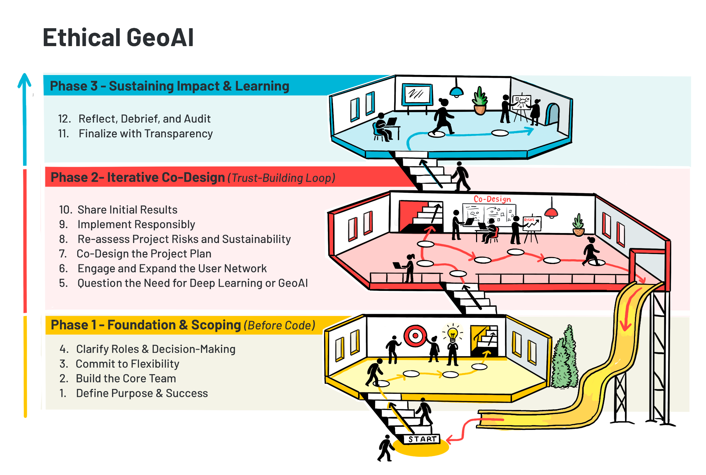

# Guidelines for Ethically Applied GeoAI with End-users using Earth Observation and Geospatial Data

**Morgan A. Crowley** a,&#42;†, **Erin Trochim** b,&#42;, **Gabriela Gongora-Svartzman** c,&#42;, **Julia Harvie** a, **Karlee Zammit** d, **Colin B. McFayden** a

a Great Lakes Forestry Centre, Canadian Forest Service, Natural Resources Canada, Sault Ste. Marie, Ontario, Canada 
b Institute of Northern Engineering, University of Alaska Fairbanks, Fairbanks, AK, USA 
c Khoury College of Computer Sciences, Northeastern University, Miami, FL, USA 
d Northern Forestry Centre, Canadian Forest Service, Natural Resources Canada, Edmonton, Alberta, Canada 

**&#42; These three authors contributed equally to this work and therefore share first authorship.**  

† Corresponding author. Tel.: +1 249 525 6429; E-mail address: morgan.crowley@nrcan-rncan.gc.ca (M. Crowley).

## Abstract:

This chapter introduces a framework for applying geospatial artificial intelligence (GeoAI) in a practical and ethical approach to build trust through engagement with a variety of end-users. With the growing advancements of GeoAI approaches and increasing use of them in decision-making, it is important that new projects thoughtfully integrate responsible and ethical approaches into their workflows. In addition to technical challenges from model biases and environmental impacts, social challenges can arise with GeoAI applications when stakeholders and end-users experience mistrust of outputs and extractive research practices. This chapter presents a 12 step framework for ethically co-developing GeoAI projects, emphasizing inclusive stakeholder engagement, intellectual humility, iterative design, and critical assessment of model necessity and performance. The framework engages with key ethical considerations, including accountability, transparency, power and participation, data sovereignty, and the real-world impacts of GeoAI on communities. It also addresses real-world barriers for ethical approaches, such as resource constraints, expectation management, and engagement overlap, by presenting practical solutions for navigating these issues. Through applied examples and reflections, the chapter presents ethical GeoAI not as a final endpoint but rather as an evolving and iterative process that builds meaningful, trustworthy, and locally relevant impact.

#### Keywords:

Ethics, responsible AI, ethical AI, GeoAI, co-development, trust building, end-users

## 1. Introduction

*Throughout this chapter, specialized technical terminology is employed. Readers are encouraged to consult the provided glossary (Appendix I: Glossary of Terms) at the end of the chapter should any term require clarification.*

Geospatial artificial intelligence (GeoAI) sits at the intersection of how we observe the Earth and how we analyze it using computational methods. In the context of deep learning applications, GeoAI increasingly relies on large volumes of Earth observation and geospatial data, including elevation, climate, weather, soils, vegetation, and built infrastructure, as well as dynamic hazards such as landslides and flooding. As described in this book, we can now process these data streams using advanced models capable of detecting patterns, classifying features, and generating predictions with greater utility than ever before. As a result, GeoAI systems function not only as technical tools, but as components of a broader decision-making process, where the strengths of deep learning must be understood alongside their limitations. As these systems become more widely adopted and embedded in practice, questions of how they are interpreted, trusted, and applied become just as important as their technical performance.

Over the past couple of years, the use of AI has rapidly expanded in society and daily life [(Marquis et al., 2024)](https://www.zotero.org/google-docs/?Db13UA). AI methods include a vast assortment of applied statistical, predictive and generative systems (e.g., machine learning, deep learning, large language models, and foundation models) [(Gutierrez et al., 2024; Ravichandran et al., 2023)](https://www.zotero.org/google-docs/?uBq6OH). As AI has expanded to support everyday tasks for the general public [(Evidently AI, n.d.)](https://www.zotero.org/google-docs/?qthJS9), the use of AI (including deep learning) has advanced dramatically within science domains, including for analyses of Earth observation and other geospatial data [(Liu et al., 2023; Tuia et al., 2024)](https://www.zotero.org/google-docs/?po9eRu). Despite these massive advances in science and society, many applications of AI still heavily rely on human oversight to produce meaningful/relevant outputs [(Grassini & Koivisto, 2024; Hubert et al., 2024)](https://www.zotero.org/google-docs/?0gli8G). For many scientific applications of AI, human interpretation or modification of the output is still a required step in the pipeline [(Saba, 2024; Tursunalieva et al., 2024)](https://www.zotero.org/google-docs/?U17NGY). As the utility of AI-generated outputs increases, so too does the importance of human judgment in determining how those outputs are understood and applied.

AI approaches are not infallible and come with additional downsides and costs. For example, many AI generative models are prone to confabulations/hallucinations (i.e., generating false or illogical information that appears correct) and model collapses (i.e., decline in model quality when repeatedly trained on AI-generated data) that can increase misinformation or misinterpretations [(Marcusa, 2024; Marwala, 2025; Ray, 2025; Shumailov et al., 2024)](https://www.zotero.org/google-docs/?s68xeX), and broader AI techniques have large financial and environmental footprints due to increased computing requirements [(Strubell et al., 2020)](https://www.zotero.org/google-docs/?f0eum3). Additionally, generative AI approaches can be prone to perpetuating social issues and gender gaps due to underlying algorithmic biases and discrimination [(Barry & Stephenson, 2025; UNESCO, 2024)](https://www.zotero.org/google-docs/?ofx4lT). Opportunities exist, however, to responsibly use AI to enhance human perspectives and participation in the future, especially in the realm of scientific co-development with communities and stakeholders for decision-making [(Rastogi et al., 2023)](https://www.zotero.org/google-docs/?5KdCmg).

There have been calls to use AI to make scientific advances in the fields of remote sensing and Earth observations [(Crowley & Cardille, 2020; Liu et al., 2023; Tuia et al., 2024)](https://www.zotero.org/google-docs/?6RGGnL), for example in terms of improving data analysis at scale [(NASA Science, 2022)](https://www.zotero.org/google-docs/?EvUfpc), improving predictions and applied insights [(Ban & Persello, 2026)](https://www.zotero.org/google-docs/?wwzC7D), as well as advancing on-board satellite processing of algorithms [(Chintalapati et al., 2025)](https://www.zotero.org/google-docs/?QmrDWX). However, there still exist tensions and challenges between data producers and data users in terms of a lack of trust in AI-derived geospatial outputs [(Kuglitsch et al., 2022; Paolanti et al., 2024)](https://www.zotero.org/google-docs/?9WXlJe). Additionally, with many AI applications focusing on large-scale analyses, the oversimplification of complex interactions and one-size-fits-all approaches can further contribute to shortcomings and a lack of applicable results [(Ertl et al., 2020)](https://www.zotero.org/google-docs/?NBHzFu). As access to AI increases, the rate of AI-related incidents and hazards continues to rise [(Feffer et al., 2023; London & Heidari, 2024; OECD.AI, n.d.)](https://www.zotero.org/google-docs/?qqBX1n). Understanding these issues is vital for the development of ethical and responsible approaches to the application of AI in science and society [(Feffer et al., 2023; London & Heidari, 2024; OECD.AI, n.d.)](https://www.zotero.org/google-docs/?2mcdfT), as further highlighted by the recent calls for and development of ethical principles and guidelines for the use of AI [(Barbier, 2018; CDAO, Responsible AI Division, n.d.; Hayes, 2023; McMaster Health Forum, 2024; NASA Science, 2022; The White House, 2023)](https://www.zotero.org/google-docs/?TTHVrv).

Calls for the ethical and responsible use of AI mirror those made in data science [(Hand, 2018)](https://www.zotero.org/google-docs/?w6Udyt), geospatial data ethics [(Nelson et al., 2022)](https://www.zotero.org/google-docs/?f8w1fx) and critical/ethical remote sensing [(Bennett et al., 2022, 2024; Ghamisi et al., 2025; Kochupillai et al., 2022)](https://www.zotero.org/google-docs/?41FpJ6). Prioritizing ethics in data science requires scientists to consider the concepts of personal data, data ownership, consent and purpose of use, inherent biases or trustworthiness of data and algorithms, and privacy and confidentiality [(Hand, 2018)](https://www.zotero.org/google-docs/?3339i5). These ethical data science topics have been further explored in geospatial information science to include ethics (locational privacy, cartographic integrity), empathy (data representativeness, interference) and equity (democratizing access) [(Nelson et al., 2022)](https://www.zotero.org/google-docs/?Pvczl5). In remote sensing and Earth observations, ethics have been identified as critical in a variety of applications, including in archaeology [(Davis & Sanger, 2021; Fisher et al., 2021)](https://www.zotero.org/google-docs/?BA5JCL), conservation sciences [(York et al., 2023)](https://www.zotero.org/google-docs/?ctr1a3), cloud-based Earth observation science education [(Crowley et al., 2023)](https://www.zotero.org/google-docs/?i190MS), and machine learning change detection [(Richardson et al., 2025)](https://www.zotero.org/google-docs/?AHnzVz). Qualitative remote sensing is an emerging field of research that exposes injustices, engages diverse knowledge, and empowers marginalized actors [(Bennett et al., 2022)](https://www.zotero.org/google-docs/?w0IF0p). Building upon this initial framework, they made a six-step framework for working towards more ethical and responsible remote sensing, integrating teaching, accessibility and acknowledgement on top of exposure, engagement, and empowerment [(Bennett et al., 2024)](https://www.zotero.org/google-docs/?oBzjFE). Ethical and responsible approaches to AI usage in Earth observation sciences have been underscored through groups and movements like AI4EO and AI/EO for social good [(Ghamisi et al., 2025; Kochupillai et al., 2022)](https://www.zotero.org/google-docs/?oeF1mp). Specifically, Kochupillair et al. [(2022)](https://www.zotero.org/google-docs/?vMubRe) developed an initial flowchart for AI4EO researchers to use to identify ethical issues in their research, like privacy, honesty, integrity, fairness, responsibility, and sustainability.

There are many benefits to individual researchers and society when integrating ethical approaches into applied GeoAI and remote sensing analyses [(Kochupillai et al., 2022)](https://www.zotero.org/google-docs/?wH5OgF). For example, interdisciplinary collaboration between researchers, stakeholders, and communities can increase the adoption of AI in land management [(Kuglitsch et al., 2022)](https://www.zotero.org/google-docs/?ytneXY), and explainable findings and algorithmic fairness can foster trust even further [(Black et al., 2023; Dramsch et al., 2025](https://www.zotero.org/google-docs/?DI5PRI)). Ethical approaches to remote sensing must inherently address helicopter and parachute sciences, which are increasingly common practices that exploit local communities for scientific gain [(Else, 2025; Naji et al., 2026)](https://www.zotero.org/google-docs/?s1rQL8). Additionally, by engaging in locally relevant remote sensing solutions, regionally trained or fine-tuned machine and deep learning land cover models can strengthen scientific outcomes and avoid global classification pitfalls [(Tulbure et al., 2022)](https://www.zotero.org/google-docs/?GvSQry). In addition to the initial workflow from Kochupillair et al. [(2022)](https://www.zotero.org/google-docs/?rcLvTi) for identifying ethical issues in AI and EO research, there are a variety of existing frameworks that the field of GeoAI can draw upon for ethical approaches and guidelines for the co-development of applied deep learning projects [(Barbier, 2018; CDAO, Responsible AI Division, n.d.; McMaster Health Forum, 2024; NASA Science, 2022)](https://www.zotero.org/google-docs/?ErMJyS). That said, one-size-fits-all governance approaches to responsible and ethical AI also pose challenges in a field that is proliferating at a rapid pace [(Kembery, 2024)](https://www.zotero.org/google-docs/?13HMWT), thus requiring field-specific guidelines for ethical AI applications. Additionally, while there are guidelines and calls for increasing responsible AI usage, if not mandated or required, integrating ethical principles into GeoAI projects relies heavily on scientists’ personal capacity for ethics in the form of intellectual humility [(Porter et al., 2022)](https://www.zotero.org/google-docs/?3HBMOx). Therefore, it is important to establish accessible and tailored approaches for co-developing ethical GeoAI that build upon the fields of ethics in AI, EO and qualitative remote sensing.

Even well-established frameworks rely on processes of specification, balancing, and context-sensitive judgment rather than the direct application of rules (Beauchamp and Childress, 2009). At the same time, the distinction between ethical theory and its application is itself unstable, as ethical reasoning is continuously shaped through practice (Beauchamp, 1984). Within GeoAI and Earth observation, this reframes ethics as a question of how decisions are made, implemented, and evaluated in practice, rather than solely what principles are articulated. This perspective aligns with recent work in AI ethics that emphasizes the persistent challenge of translating ethical concepts into design, tools, and governance structures, rather than resolving a simple divide between theory and practice (Bleher and Braun, 2023).

Our choice in this orientation is in response to the critiques of principle-based AI ethics, which can enable checklist-style compliance and “ethics washing” when detached from real-world contexts (van Maanen, 2022), as well as to the persistent gap between ethical frameworks and their operationalization in system design and governance (Prem, 2023). As in qualitative remote sensing, ethical evaluation must account for the social and political conditions in which these systems are embedded, including power asymmetries and structural background injustices that shape both technological development and its impacts (Heilinger, 2022). In this sense, ethical GeoAI is grounded not only in technical design, but in its consequences for human well-being, particularly the ways in which systems expand or constrain people’s real opportunities and capabilities (Robeyns, 2025).

Building on this orientation, our approach is grounded in a set of recurring ethical dimensions that emerge through practice rather than abstraction. These include the role of character and responsibility in guiding decisions; the need to move beyond checklist-style compliance toward context-aware judgment; attention to power, participation, and inclusion; a focus on human capabilities and lived outcomes; recognition of cognitive limitations and the need for humility; mechanisms for accountability and transparency; and critical reflection on whether GeoAI is the appropriate intervention at all. Rather than functioning as a prescriptive framework, these dimensions act as guiding lenses that shape how GeoAI systems are designed, evaluated, and applied. Together, they form the conceptual foundation for the 12 step process that follows.

Recent advances in large language models (LLMs) further expand the scope of GeoAI by enabling new forms of interaction, synthesis, and decision support. While not the central focus of this chapter, these systems introduce additional ethical considerations related to reasoning, representation, and the translation of geospatial knowledge into actionable insights. We return to these implications in the concluding discussion. With this framing in place, we now turn to the objectives and structure of the chapter.

### 1.1. Chapter Objectives

This chapter outlines a structured framework for the ethical application of AI in the context of Earth observation and geospatial data (i.e., GeoAI). By the end of the chapter, readers will understand the importance of ethical GeoAI, learn a step-by-step approach for ethical GeoAI applications, identify and overcome common challenges, and apply ethical frameworks to real-world GeoAI research case studies.

**Figure 1.** Overview of the 12 step guidelines for ethically co-developing GeoAI projects as presented in Section 2. The guidelines are organized into three interconnected and iterative phases to illustrate that ethical GeoAI is an evolving process grounded in continuous engagement, reflection, and adaptation. Phase 1 (*Foundation and Scoping*, Steps 1–4) focuses on defining purpose and successes, building the core team, committing to flexibility, and clarifying roles before any technical development begins. Phase 2 (*Iterative Co-Design*, Steps 5–10) represents a trust-building loop in which teams question the need for GeoAI, engage and expand user networks, co-design project approaches, reassess risks and sustainability, implement responsibly, and share initial results. Phase 3 (*Sustaining Impact and Learning*, Steps 11–12) emphasizes finalizing the project with transparency and dedicating time to reflection, debriefing, and process auditing.
*Note: Figure designed by authors and designed and digitally drawn by artist Liisa Sorsa of Thinklink Graphics*

## 2. 12 Steps for Ethical GeoAI

This section outlines a 12 step framework for ethically co-developing GeoAI projects (Figure 1). The process is iterative, not strictly linear, and benefits from continuous engagement and reflection. This 12 step framework has been developed through the authors’ sustained engagement in GeoAI research and practice, including the co-development of systems with diverse stakeholders. It is informed by iterative cycles of implementation, evaluation and reflection. These guidelines aim to capture cross-cutting ethical and practical considerations observed across multiple contexts and projects.

### 2.1. Step 1: Define Purpose and Success

Every project presents unique challenges and limitations, therefore, the initial phase involves establishing a comprehensive understanding of the community impacted, the stakeholders involved, and the underlying goals and guiding principles that frame the project's scope. An important principle to have in mind in this initial stage is intellectual humility. This involves acknowledging the limits of one’s expertise, conducting due diligence of existing literature and critically evaluating whether the research team is best positioned to lead the effort. This includes recognizing when other actors, especially community stakeholders, hold a greater contextual knowledge, legitimacy or even the motivation to drive the project.

Important questions to address at this stage include identifying the overarching goal or desired outcome, understanding the broader context and motivations behind the project, and clarifying who the stakeholders are. Additionally, clearly defining the project's scope, which includes available resources, funding, and timelines, is crucial. Defining success requires careful consideration beyond standard machine learning or AI performance metrics. Specifically, metrics should be contextualized, ethically examined, and reflective of community impacts, including considerations of who is represented or omitted. Early identification and establishment of necessary agreements (e.g., Institutional Review Board \[IRB\], Ownership, Control, Access, and Possession \[OCAP\], data-sharing agreements) are also essential, as they guide ethical considerations and project timelines.

To operationalize this step, the following guiding questions can be used:

1.  What is the overarching goal of the project, what is it ultimately trying to achieve, and why is GeoAI being used?

2.  What is the context that surrounds the “big picture”? This question is meant to give you the “lay of the land.” Therefore, it is important to define the motivation behind the project, the background that led to this motivation, and the core values behind it. This will help to define the driving purpose of the project.

3.  Who are the stakeholders and/or Rightsholders? In other words, which community will the project impact?

Once the previous questions have been crafted, it will be easier to begin defining the “how” behind the project. The following questions will help define this area:

1.  What is the scope of the project, considering the resources, grants in place and prospective timeline?

2.  How will success be defined in this project? What will be the expected deliverables at the end of the project?

3.  What performance metrics will aid in assessing the success of the project? As experts in the field, we tend to go straight into traditional performance metrics. For example, for machine learning models, this point is often overlooked because people will go straight to measuring F1-score, accuracy, precision, recall, and so forth. These metrics work, but lack context. You want to spend time thinking about what these metrics mean in terms of your specific project. Who is accounted for in the metrics? Who is left out? What tradeoffs are you willing to make in terms of accuracy vs. inclusivity? Run through the ethical and contextual considerations of each metric, write them in terms of your community rather than in mathematical terms.

4.  What agreements need to be in place for this project to take place? Identify and create all agreements required to conduct this research (e.g., IRB, OCAP, and other data-sharing agreements). It is important to have an understanding of these during the early stages of your project, as they will help you outline the ethical considerations of your project, as well as properly outline times, dates, and prospective plans.

### 2.2. Step 2: Build the Core Team

The second step involves forming a foundational network comprising experts and user collaborators who share aligned values. This is inherently an iterative process, requiring openness to incorporating additional collaborators and revisiting shared values throughout the project lifecycle. Effective communication with initial stakeholders demands awareness of appropriate languages, terminologies, and cultural norms to facilitate mutual understanding. Establishing this network is significantly streamlined after completing the initial project definition stage in Step 1.

### 2.3. Step 3: Commit to Flexibility

Operationally, intellectual humility requires treating project plans as evolving rather than fixed. Initial assumptions about data quality, timelines and even methodological approaches will benefit from remaining open to revision and reformulation as new information emerges. Stakeholders are not merely consultants, but they also bring diverse experiences and perspectives, necessitating shifts in project direction, scope, or methodologies. Stakeholders can experience redistribution of ownership or changes in leadership, which will impact the project in terms of vision, motivation and event timelines. Additionally, sensitivity to stakeholder dynamics calls for a flexible approach, where trust is built through initial, small-scale collaborations before scaling up. In practice, this step involves leaning on the initial trust built with the stakeholders, and being flexible to navigate changing collaborations and reshaping the project scope as understanding deepens.

### 2.4. Step 4: Clarify Roles and Decision-Making

At this stage, after forming the foundational network described in Step 2, further divide into roles including drivers, users, stakeholders, and decision-makers. Understanding each role’s influence on the project enhances clarity. Different audiences, such as practitioners versus new users, must be addressed separately, as their definitions of success may differ. Integrating their perspectives with your own definition of success and ensuring all members of the project network agree is vital for coherent progress.

### 2.5. Step 5: Question the Need for Deep Learning or GeoAI

After thorough data exploration and defining success metrics, it is essential to critically assess whether deep learning or GeoAI models are genuinely required. Preliminary attempts using expert or classical machine learning models should precede complex methods. If a GeoAI approach is selected, it is still valuable to have a classical benchmark to compare results to further justify the use of GeoAI. GeoAI models often sacrifice interpretability, which can hinder sustainable deployment post-project. Rigorous data preprocessing and feature engineering, combined with ethical data handling, significantly influence model performance and sustainability.

### 2.6. Step 6: Engage and Expand the User Network

This step involves broadening the collaborative network and actively consulting potential users. It is necessary to confirm whether the proposed solutions genuinely address users’ needs and if the solution offers tangible advantages over existing methods. Solidifying the perceived value, necessity, and practical utility of the project outcomes is essential.

### 2.7. Step 7: Co-Design the Project Design

Meticulous attention to methodology and data integration is critical at this stage. Establishing ground rules for meeting frequency, task distribution, code review procedures, peer programming strategies for less-experienced coders, and data management tools is fundamental. Consistent software environment setups, particularly in languages like Python, are essential for team coherence and efficiency.

### 2.8. Step 8: Re-Assess Project Risks and Sustainability

Regular discussions with both expert and user networks about project design are essential to verify alignment with needs, identify tradeoffs, and assess risks. Clear communication of risks, sustainability plans, and contingency strategies (including simpler and more advanced alternatives) will help ensure long-term project viability. Projects benefiting larger areas often garner sustained funding and community support, facilitating greater reliability.

### 2.9. Step 9: Implement Responsibly

Armed with meticulous preparation, the implementation phase encompasses developing, validating, testing, evaluating, and deploying the selected models. Validation procedures should ensure model robustness across various conditions, while testing must confirm suitability for user deployment. Flexibility in adapting models from ideal scenarios to realistic constraints ensures objectives remain achievable.

### 2.10. Step 10: Share Initial Results

Before concluding, preliminary findings must be transparently discussed with core user and expert networks. Even unsuccessful outcomes provide valuable insights, guiding future directions and adjustments. Effective communication and visualization tailored to typically non-technical stakeholders' preferences are crucial, ensuring alignment with actual stakeholder expectations rather than assumed needs.

### 2.11. Step 11: Finalizing with Transparency

Crafting the final output involves critically assessing whether results meet initial success metrics and planning for sustainability and code maintainability post-project. Effective visualization techniques, tailored to the target audience, are crucial for effectively conveying project outcomes. Additionally, be sure to tailor the documentation to the expected user group to ensure long-term reliable performance. It is critical to continue to be transparent about the trade-offs and limitations associated with the methods, and to discuss the inherent bias in the data and how it shows up in the output (i.e., where/when does it work? where/when will it not work?).

### 2.12. Step 12: Reflect, Debrief, and Audit

Conducting thorough debriefing sessions with both collaborators and users facilitates understanding of successes and challenges related to communication, team dynamics, processes, and overall project experience. These discussions help identify areas for improvement and foster closure. Recognizing that difficulties or failures can stem from external factors such as insufficient data or inadequate processes underscores the importance of documenting successes and building resilient, ethical relationships throughout the project lifecycle.

## 3. Potential Challenges and Opportunities

### 3.1. Introduction

While crucial in principle, ethics in GeoAI and remote sensing present significant challenges during practical implementation. Applying ethical considerations involves navigating complex tradeoffs, balancing competing priorities, and addressing diverse and sometimes conflicting values inherent in working with geospatial data and advanced AI techniques. This section explores key hurdles in embedding ethical approaches into GeoAI projects and identifies opportunities to make these obstacles into pathways for more responsible and impactful work. While Section 2 provides a framework or guidelines of ethical considerations, this section delves into the practical difficulties of addressing those points effectively.

### 3.2. Resource Constraints and Sustainable Engagement

Meaningful ethical engagement in GeoAI projects demands significant resources – including time, funding, and personnel – that must be carefully balanced with other project demands like technical development, data processing, and results dissemination. While ethical considerations entwine all project dimensions, the need for genuine collaboration and incorporation of different perspectives often presents a substantial resource challenge. Project teams frequently underestimate the investment required to cultivate authentic community partnerships, integrate diverse knowledge systems alongside scientific data, and maintain transparent communication throughout the project lifecycle. These engagement demands conflict with rigid research deadlines, funding cycles, and team availability constraints.

Effectively planning for ethical engagement requires explicit allocation for costs associated with meaningful participation, such as compensating community members or stakeholders for their time, local expertise, or unique insights (especially crucial when utilizing remote sensing data related to their land or lives). Sustaining relationships and ensuring ongoing transparency demands commitment beyond typical project boundaries, requiring strategic long-term planning.

There is no universal solution to these resource challenges. They are most manageable within programs that proactively allocate sufficient time, dedicated funding, and personnel for ethical engagement. Pragmatic assessment of what is realistically achievable within project constraints is essential. Collaborating with individuals or organizations in boundary-spanning roles – those adept at connecting technical teams with local contexts, facilitating community introductions, and navigating institutional landscapes – can significantly maximize limited engagement resources.

Selecting appropriate metrics for engagement, whether formal reports or informal relationship milestones, is vital. These metrics should foster mutual understanding, generate actionable insights for local decision-makers, or demonstrate how GeoAI outputs will contribute value in priority societal benefit areas. The chosen approach must align with available resources while honoring core ethical commitments to respectful engagement and meaningful participation.

**GeoAI nuance:** Resource challenges are exacerbated by the scale and complexity of geospatial data processing and model training. Allocating resources for ethical checks, like assessing data bias across different geographies or conducting localized validation of models, directly competes with computational budget and personnel time for core technical tasks.

### 3.3. Diverse Expectations and Cultivating Trust

Two critical challenges in ethical GeoAI implementation involve managing diverse expectations and cultivating trust, familiar concepts amplified by the technical specificities of the field.

Researchers often underestimate the diversity of interests and perspectives within their teams and among collaborators, data providers, end-users, community partners, and decision-makers. A deliberate exercise in perspective mapping – identifying and understanding these varied viewpoints, including their relationship to geospatial data and technology – is fundamental. This process uncovers what stakeholders value in GeoAI (e.g., predictive accuracy vs. local applicability vs. data privacy), what constitutes success from their standpoint, and what constraints (technical, social, political, financial) they recognize.

Understanding these perspectives allows teams to define better, meaningful GeoAI outputs that address goals shared across the stakeholder network. At the same time, GeoAI and remote sensing offer powerful capabilities, technical advancements (like improved model accuracy or new feature extraction techniques) don’t always automatically translate to equivalent, trusted impact in application contexts, particularly at local scales or within communities unfamiliar with the technology. This "implementation gap" often fuels legitimate skepticism about the practical value of Earth observation and AI-derived insights.

No single model choice or project design can eliminate this gap. However, researchers who critically and introspectively apply ethical considerations can define additional success criteria beyond technical performance (e.g., usability by non-experts, fairness across different groups, alignment with local knowledge) to create project designs more aligned with meaningful, trustworthy impact. This involves actively testing assumptions about user needs through direct engagement rather than solely relying on technical literature, establishing transparent feedback mechanisms that allow course correction based on user experience and ethical review, clearly communicating the capabilities and limitations of proposed GeoAI approaches (including model uncertainty and potential biases), and documenting methodological choices in accessible language.

Trust-building becomes more natural and sustainable with this foundation of mutual understanding and transparency. Genuine curiosity about differing perspectives fosters more authentic conversations. Rather than positioning researchers as technical experts simply delivering GeoAI solutions, this approach reframes the relationship as a collaborative learning process where technical, domain, and contextual expertise (including local and indigenous knowledge) are equally valued. Building trust requires consistent communication, respect for different knowledge systems, and commitment to follow through on agreed-upon steps and boundaries. When stakeholders see their input genuinely shaping project direction and that researchers honor commitments (like data usage agreements or reporting back results), trust can develop, extending beyond individual projects to foster lasting partnerships crucial for practical and ethical GeoAI applications.

**GeoAI nuance**: Expectation management in GeoAI is particularly challenging due to the complexity and often opaque nature of AI models ("black boxes"), the inherent uncertainty in remote sensing data (cloud cover, sensor noise, atmospheric effects), and the variable resolution/scale of geospatial information. Communicating these limitations transparently and using explainable AI tools is key to building realistic expectations and trust. Trust is also impacted by the historical misuse of geospatial data or technologies in specific communities.

### 3.4. Navigating Connectivity and Mitigating Overload

In our interconnected professional landscape, collaboration is both a valued competency and an increasing expectation. The ease of digital connection has expanded project scope, often demanding broader engagement and wider perceived impact, regardless of practical constraints. This can lead to overconnection and cognitive overload for individuals and teams. A more useful framing moves away from maximizing connections to asking: what level of engagement is sufficient, meaningful, and sustainable for ethical GeoAI?

Even within established communities or organizations, comprehensive engagement remains challenging. The path to meaningful collaboration begins with cultivating a shared vision and identifying key stakeholders whose goals align with this "north star," providing crucial support when navigating inevitable obstacles. Successfully managing multiple stakeholder relationships, balancing global technical perspectives with essential local expertise, and preventing communication fatigue among project participants are significant leadership challenges requiring intentional strategies.

The reality of competing priorities across diverse researchers and stakeholders creates an overload. This necessitates intentional and structured approaches to engagement. GeoAI project leaders should cultivate grace, understanding, and patience, recognizing that collaborators have diverse demands on their time. Developing structured engagement frameworks that explicitly respect participants' time constraints and capacity is a foundation for sustainable collaboration. Creating tiered communication channels tailored to the needs and technical capacity of different researchers and stakeholders (e.g., detailed model documentation for technical users, executive summaries and visual outputs for decision-makers, and community workshops for local context validation) enables more efficient information sharing. Establishing clear boundaries on availability and responsibilities prevents engagement burnout while still maintaining meaningful connections. Ensuring appropriate recognition or compensation for participants' time and expertise (unless participation aligns directly with their established roles or is a formal voluntary agreement) is a fundamental ethical practice that respects their contribution and mitigates the burden of engagement. This approach emphasizes depth over breadth in critical relationships and includes periodic reflection to assess whether current engagement strategies effectively serve project goals and ethical commitments.

By acknowledging the limits of human attention and organizational capacity, ethical GeoAI projects can foster more meaningful connections that generate lasting value rather than transient, superficial engagement. This approach recognizes that the quality of engagement matters more than its quantity, particularly when working across the technical disciplines, knowledge systems, and organizational cultures inherent in GeoAI.

**GeoAI nuance:** Overload in GeoAI is compounded by the volume and velocity of geospatial data, the complexity of AI models, and the need to integrate diverse types of expertise (remote sensing, AI/ML, domain science, ethics, social science, local knowledge). Managing the flow of information and ensuring key insights and ethical concerns are not lost in the noise is a significant challenge.

### 3.5. Foundational Research and Downstream Impacts

GeoAI projects do not always tie back to a specific end-user or real-world phenomenon. Foundational methodologies and core algorithm development can also be a focus. Superficially, these projects don’t require extensive community or stakeholder consultation. However, the potential downstream effects of applying these models and algorithms in future scenarios warrant careful consideration. Novel techniques for feature extraction, data fusion and more efficient neural network architecture will be used in unforeseen applications tomorrow, and any biases, limitations, or flaws in the original methodology can be amplified at scale when adopted by others.

Forward-looking practices include documenting the model's architecture, its training data (including geographic and demographic scope), its known failure points, and the assumptions inherent in its design. Defining anticipated further use cases, even if not included in that iteration of the project, and including potential limitations is beneficial to future applications. Understanding the limitations of standard benchmark data and how more complex but realistic data can stress test new methodologies is valuable. Prioritizing reproducibility through clear documentation also allows the next iteration of algorithm applications or usage to build more effectively and iterate.

**GeoAI nuance:** The trend towards rapid, global scaling makes this challenge notable in GeoAI. Compartmentalization and connectivity of model results mean that it can be difficult for end-users to independently diagnose hidden limitations. Transparency within the original algorithm creators has important implications for mitigating this ethical burden.

### 3.6. The Path Forward: From Principles to Practice

Embedding ethics into GeoAI and remote sensing work is an ongoing process filled with unexpected challenges and no definitive endpoint. While this section has outlined key hurdles and potential approaches, the reality of ethical implementation is often far messier than any guidelines (as presented in Section 2) can fully capture. As introduced earlier, we frame ethics not as a fixed set of principles, but as a situated and iterative process shaped by context, judgment, and application. From this perspective, the limits of prescriptive guidance are expected, as ethical practice unfolds through real-world constraints, competing priorities, and evolving understanding.

Through this context, what matters most is not perfect adherence to abstract principles or flawlessly executed engagement strategies, but rather the willingness to continuously grapple with difficult questions and tradeoffs when easier, less ethical paths present themselves. This journey demands intellectual humility – recognizing the limits of our technical perspectives, the invaluable insights others hold, and the persistence to navigate ethical dilemmas despite inevitable setbacks and conflicting demands.

The most transformative ethical work often emerges from moments of tension and uncertainty, where GeoAI researchers and stakeholders collaboratively navigate competing priorities (e.g., accuracy vs. interpretability, global scale vs. local relevance, speed vs. careful engagement), guided not by rigid rules but by a shared commitment to creating responsible and meaningful impact. In these spaces, the catalyst for growth isn't checklist completion but genuine curiosity about the ethical implications of our work, including those explicitly outlined at the end of Section 1 and carried forward through the framework, and the courage to acknowledge when our technical or engagement approaches need revision based on ethical feedback.

By embracing this inherent uncertainty rather than attempting to eliminate it, we create space for innovation in our GeoAI applications, human connections, and ethical reasoning. This iterative process strengthens the scientific integrity and the societal value of our GeoAI work in ways that mere compliance alone never could. Understanding these challenges is the first step toward actively working to overcome them, as illustrated by the examples in Section 4.

## 4. Applied Examples

### 4.1. Students or Newer Practitioners With Decision-Makers

To illustrate how these principles are applied in practice, we present the following case studies. This first case study offers a generalized example of how ethical GeoAI principles can be applied to real-world, data-driven government agencies with policy challenges. It draws on the lived experience of supporting an organization that works to craft policy solutions. Given the sensitive nature of policy and population data, where insights can directly influence policy decisions affecting vulnerable populations, the project required careful attention to privacy, data governance and the potential for unintended harm or misuse.

In particular, the work involved transforming the manual collection of monthly relevant policy data into an automated, scalable process. By applying the 12 step framework outlined in Section 2, this project serves as a practical model for bridging the gap between new GeoAI practitioners and mission-driven stakeholders. The team in this scenario consisted of a faculty advisor and six students (new practitioners), while the stakeholders lent their expertise as policy analysts with little to no technical experience. The particular focus of this case is on the unique considerations and challenges that arise when the project team is composed primarily of new practitioners.

The stakeholders in this initiative relied heavily on the data to inform timely and accurate policy recommendations. Historically, this data was collected manually through an inefficient, error-prone process that limited scalability and delayed geo and policy analysis. The project’s core objective was to automate the acquisition, cleaning, formatting, visualization, analysis, and generation of recommendations for this data.

In alignment with Steps 5 (Question the Need for Deep Learning or GeoAI) and 9 (Implement Responsibly), the resulting system prioritized interpretability and sustainability by avoiding unnecessary complexity. The pipeline streamlined the entire workflow: extracting data directly from government agencies, aligning it with stakeholder requirements, integrating historical datasets, and generating interactive geo-visualizations for a live dashboard. This solution directly addressed the stakeholders’ need for high-quality, consistent data to inform their policy work and public engagement. By reducing manual effort and improving data reliability, the automated system enhanced productivity and freed up staff resources for more strategic tasks. Given the geospatial dimensions of relevant data, the project also emphasized integrating GeoAI tools to uncover location-based insights that could inform evidence-based recommendations, reflecting on the contextual awareness encouraged in Step 1.

The team was composed largely of students (early practitioners), which required a greater investment in communication, trust-building, and hands-on mentorship. The faculty lead spent significant time guiding new practitioners through technical challenges while reinforcing the project's broader objectives. Regular discussions were held to clarify stakeholder goals and ensure alignment with real-world needs, echoing the principles from Step 2 (Build the Core Team) and Step 8 (Re-assess Project Risks and Sustainability). These conversations helped solidify shared values and maintain flexibility as the team progressed through the 12 step development framework.

A major consideration in working with newer practitioners was the need to establish effective team dynamics from the outset. Many team members had limited experience collaborating in professional settings, which often led to confusion about roles, uneven workloads, and misaligned expectations. Step 4 (Clarify Roles and Decision-Making) had to be extended to help early practitioners understand the process of assigning responsibilities and establishing a clear leadership and communication structure. A single liaison was designated to manage stakeholder interactions and ensure continuity in messaging. Early team-building activities, such as informal social gatherings and icebreakers, supported the relational groundwork needed for Step 6 (Engage and Expand the User Network), helping team members understand each other’s strengths and working styles.

Another key focus was helping new practitioners maintain awareness of the “big picture.” While they were eager to dive into technical details and hone their GeoAI skills, they often lost sight of the overarching goals. To address this, the team adopted a weekly stand-up format in which each student reported on their contributions and revisited the project's goals, research questions, and stakeholder needs. This ongoing framing exercise mirrors the reflective practices encouraged in Step 3 (Commit to Flexibility), helping reinforce purpose and build critical thinking around stakeholder alignment.

Despite the learning curve, having new practitioners on the team proved advantageous. Their enthusiasm and willingness to learn led to significant technical growth over the course of the project. However, they occasionally became overly focused on implementing novel tools and techniques, sometimes at the expense of stakeholder priorities. Step 7 (Co-Design the Project Plan) guided the implementation of peer programming strategies and code reviews, while faculty mentorship ensured the team stayed grounded in delivering actionable, policy-relevant insights rather than purely technical outputs.

To wrap up the project, the team conducted a structured debriefing session, guided by Step 12 (Reflect, Debrief and Audit). Students reflected on questions such as “What could we have done differently?” and “What did you learn throughout this process?” These reflections, along with a documented summary of accomplishments, methods, and next steps, created a valuable knowledge base for future teams, ensuring continuity, supporting future iterations, and reinforcing ethical and procedural learning.

In addition to delivering a functional solution, the experience reinforced the importance of collaboration, stakeholder alignment, and interdisciplinary teamwork in real-world civic technology projects. The lessons learned around communication, project architecture, and mentorship will continue to inform future efforts where novice practitioners contribute meaningfully to high-impact, data-driven work.

Discussion and reflection questions:

1.  If you are leading a project with early-career practitioners, what specific strategies might you implement to ensure the team remains grounded in the stakeholders' core needs and project goals?

2.  How can project plans, timelines, and budgets better account for the hidden work of mentoring and team building, especially when the primary goal is to deliver a product for an external stakeholder?

3.  What criteria would you use to decide when a state-of-the-art technical solution is less appropriate than a more straightforward, sustainable, and explainable one, particularly when working with non-technical end-users?

4.  How would you assess and mitigate potential privacy risks for future unintended harms when working with sensitive geospatial data that has policy implications?

Throughout the project development and implementation, the early practitioners, with faculty lead supervision and stakeholders’ input, were conscious of following several ethical considerations. The automation process incorporated safeguards to prevent the exposure of identifiable or sensitive location-based information, particularly given the risk of re-identification in geospatial datasets. The team critically evaluated the government agencies’ data for potential biases, including inconsistencies in reporting practices and structural biases.

Given the automated ingestion and storage of data, the system design included consideration for secure data handling, access control, and sustainable security measures to be handed off to the stakeholders. There was special care and multiple conversations to ensure that the geo-visualizations did not unintentionally stigmatize specific regions or populations, and that the outputs were contextualized to avoid misinterpretation.

The team reflected on how insights generated from the system might impact different communities or vulnerable populations, and aimed to support equitable policy interpretations. Establishing clear team roles also ensured accountability for ethical decision-making, including how data was handled, interpreted and communicated to stakeholders. Faculty mentorship (senior practitioner) also created an impact by guiding the early practitioners through the project (using the framework in Section 2) and ensuring that decision-making processes were transparent and did not introduce unintended biases in every step of the project development process. Overall, this case shows the usage of the framework developed in Section 2, while highlighting ethical considerations such as data privacy, bias detection, responsible communication of results and the societal impact of GeoAI-driven policy recommendations.

### 4.2. Community Collaborators Across a Large Area

This second case study presents an approach to establishing the foundational elements necessary to support future GeoAI applications in Alaska. While traditional technology projects often prioritize immediate outputs, this team recognized that investing in relationships, institutions, and knowledge infrastructure was essential to navigate Alaska's complex governance landscape. This case study explores how deliberate foundation-building efforts can facilitate future GeoAI implementation in contexts with multiple governance layers and diverse stakeholders.

The cornerstone of this approach was engaging a trusted local facilitator early in the process. This facilitator's role extended beyond organizing meetings to aligning leadership values and serving as a bridge between technical possibilities and local realities. For this to work effectively, the facilitator needed to establish credibility within the community and an understanding of both technical and cultural contexts.

The team's engagement strategy deliberately addressed Alaska's layered decision-making structures. Working simultaneously with municipal government, Tribal leadership, Native Corporations (both local and regional), university researchers, federal agencies, and private companies created a constellation of interconnected relationships rather than linear partnerships. This multi-level engagement was not without challenges—competing pressures from timelines, dependent scientific products, and community needs created occasional tensions. However, these challenges reflected the reality that future GeoAI adoption would ultimately require buy-in across these interconnected spheres. Instead of establishing another coordination mechanism in a region already navigating multiple governance systems, the team deliberately sought existing networks. By integrating with established channels, the work gained legitimacy while respecting community members' time and prior organizational investments.

The team recognized that developing GeoAI applications in this context required more than stakeholder engagement; it necessitated building a shared understanding of what solutions could look like. The development of an online learning class using the EdX platform exemplified this approach. Rather than providing narrow training on specific tools, the curriculum built broader literacy around geospatial technologies, environmental processes, coordination mechanisms, and practical applications.

Early indicators of a supportive ecosystem began to emerge: community members demonstrated increased awareness of available data resources and coordination responsibilities; existing decision-making bodies began incorporating geospatial considerations into their discussions. While the full impact of this foundation-building approach remains to be evaluated through subsequent iterations, early signals were promising. A national conference held in Alaska featured a community panel where connections between technical data and the realities of planning and real-time storm response were shared. Undergraduate university students became engaged in developing 3D models of the data to enhance communication and data sharing with community members.

Project leadership acknowledged the temporal nature of technical solutions, noting that while specific tools might become obsolete within five years, the relationships and shared understanding established through this approach would continue generating improved approaches well beyond the lifespan of current technologies.

Discussion and reflection questions:

1.  How might future GeoAI initiatives balance immediate technological goals with the longer-term work of foundation building in complex governance contexts?

2.  In what ways can teams measure and communicate the value of relationship building and trust development as project outcomes to stakeholders and funders?

3.  What preparation is needed for technical teams to work effectively within established community networks rather than defaulting to creating new coordination mechanisms?

### 4.3. Land Manager Trust Building

This third case study presents a generalized example of how ethical GeoAI principles could be applied in an operational land management context. While stripped of the specifics of the scenario, the case study itself is rooted in real-world experiences of advancing land management using new technologies and approaches (e.g., fire management and monitoring in Canada). This case study explores how building trust, engaging key bridge-builders, and integrating knowledge exchange principles can overcome potential pitfalls and facilitate ethical co-development of GeoAI in a situation where project outcomes can actually be integrated into impactful workflows for land management decision-making. Similar to other technology solutions, GeoAI tools can encounter skepticism or distrust when introduced as a fix-all to solve all problems (known and unknown) or without meaningful consultation and packaged in a black box approach. At times, even new solutions that embark on meaningful engagement can result in rejection simply because of the past experiences of the land managers who are being approached. Using the principles outlined in the 12 steps presented in Section 2 in combination with knowledge exchange principles can help bridge the gap between new GeoAI projects and land managers, while facilitating collaboration and improving adoption and trust.

In this case study, a number of actors were involved and required to rebuild trust. First, the land managers working within an organizational context were responsible for planning, resource allocation and response. The scientists and developers were the ones who developed the models that use GeoAI to advance land management approaches using satellite and geospatial data. Key to this case study were dedicated knowledge exchange specialists whose work responsibilities included providing translation between the technical, scientific team and the operational land managers. For this to work, the knowledge exchange specialists had identified and built relationships with internal advocates from the land management organizations who were respected within their organization, while also being excited and open to seeing the integration of GeoAI approaches into their pipelines. These individuals had the ability to shift systems to accommodate new approaches while also increasing individual buy-in for the new techniques.

The goal of this project was not just to develop a GeoAI tool that met the operational context, but also to do so in a meaningful and ethical way to ensure uptake and to grow capacity in using it at the organizational level. This meant that trust and usability were core criteria for the projects, not just as indicators of impact and success. To do this, they needed to address the skepticism of GeoAI tools, prevent extractive or one-way research, ensure the approaches added value, and build relationships with the users. To accomplish this, the multi-year project engaged in early scoping of project goals and user needs for the model and the outputs. The knowledge exchange team was able to create excitement at the organizational level with the early advocates who brought the updates back to their teams and shared the possibility of technological advancements. Through iterative development of prototypes and sandboxes, the technical team was able to receive feedback on the project outputs throughout development on how outputs can be used, visualized or improved. The knowledge exchange team was an accessible bridge between the practitioners and technical team, thus enabling a clear system for how to connect from either end of the team. Regular in-person workshops, virtual seminars, and one-on-one meetings helped to develop individual relationships while also providing multiple avenues for connecting with the project. However, annual meet-ups were used as key decision points to reduce engagement fatigue among the land managers.

Discussion and reflection questions:

1.  What barriers exist in your own GeoAI project that currently or could inhibit setting up an engagement plan like described in this case study?

2.  Does your GeoAI project currently have buy-in from the users? What can you do differently to improve buy-in after learning about this case study?

## 5. Conclusions and Looking into the Future

The 12 step framework for ethical GeoAI emphasizes that ethical project design should begin well before a line of code is written. Projects should start with a clear understanding of stakeholder goals, community context, and the ethical implications of success metrics. This early foundation allows teams to define not only what they want to achieve but how they want to achieve it, with integrity, transparency, and community relevance. Steps such as forming a values-aligned collaborator network (Step 2), maintaining intellectual humility (Step 3), and carefully evaluating the necessity of using advanced GeoAI models (Step 5) ensure that technical tools serve actual needs rather than imposing unnecessary complexity or harm.

The three case studies presented ranged from student-led policy dashboards to land management collaborations, demonstrating that ethical GeoAI requires active relationship-building, responsive design, and iterative development. In each scenario, success was contingent not on technical sophistication alone, but on consistent stakeholder engagement, clear communication, and co-creation of tools that matched the lived realities of users. For example, the Alaska case study showed the value of investing in local facilitators and existing community networks, while the land manager project highlighted the critical role of knowledge exchange specialists in building trust and usability into technical systems. Trust and stakeholder alignment emerged as recurring themes across all case studies, whether working with early practitioners, land managers, or broad governance networks. Establishing trust involves more than good intentions. It demands transparency, reflexivity, and a willingness to adapt based on feedback. The strongest projects maintained regular check-ins, tailored communications to different audiences, and acknowledged knowledge systems outside the technical domain.

These examples also reveal common challenges: resource constraints, expectation mismatches, engagement fatigue, and the inherent complexity of geospatial AI data. Addressing these challenges requires shifting from a checklist mentality to a mindset of ethical adaptability. Ethical GeoAI is not about avoiding failure; it is about confronting uncertainty, documenting tradeoffs, and designing systems that prioritize long-term impact over short-term output. By embedding ethics throughout the lifecycle, from scoping to debriefing, GeoAI teams can build projects that are not only technically sound but socially meaningful, transparent, and worthy of trust.

GeoAI represents a key frontier in applying AI to Earth Observation. While its foundations are well established, the role of newer technologies like LLMs in this space is only beginning to be explored and understood. LLMs are rapidly being adopted for tasks including synthesis, coding and decision support. As introduced earlier, these systems raise important ethical considerations related to data provenance, representation, and trust, especially in contexts where communities may not have consented to how their data or knowledge are used. Similar to concerns raised in parachute science, these dynamics can introduce extractive elements and challenge local autonomy. In some cases, the presence of LLMs in a workflow may itself be perceived as an ethical concern, particularly in relation to issues of participation, data ownership, and trust discussed earlier in this chapter.

At the same time, LLMs, multi-agent systems, and other reasoning advancements have the potential to both complement and enhance the processes outlined here, while also introducing new layers of complexity and challenge. Within this context, we explicitly encourage you to experiment. This chapter can be used as input to LLM platforms for synthesis, ideation, and stakeholder coordination. Use these tools to combine specific project details with the ethical and procedural guidance offered here. LLMs can serve as an additional perspective in the process of reflection, brainstorming, and even documentation. However, doing so requires careful attention to context. Effective use of LLMs will require more information than what is in this chapter, including the historical, sociological and environmental specifics of the area your project covers. If LLMs are incorporated into a workflow, this should be done early in the project design process, with clear communication and, where appropriate, consent from project teams and stakeholders.

Finally, we offer a cautionary note that GeoAI, LLMs, and related tools are not perfect and they will not solve everything. Practitioners must develop the judgment to know when to pause, when to proceed with care, and when to focus efforts elsewhere. In some cases, stakeholders may have strong reservations about AI-based interventions, and it can be more productive to build trust gradually or prioritize other opportunities. Navigating issues such as data sovereignty, open data tensions, and community concerns requires sensitivity, transparency, and a commitment to respectful engagement. Ethical GeoAI means knowing when to move forward and when to step back. “Trust, but verify” applies not only to data and models but also to partnerships, processes, and outcomes. The goal is not to chase innovation at all costs, but to ensure that technological progress is grounded in ethical co-development and mutual respect.

## 6. References

[Ban, Y., & Persello, C. (2026). *Artificial Intelligence for Earth Observations (AI4EO)*. Group on Earth Observations. https://earthobservations.org/groups/artificial-intelligence-for-earth-observations](https://www.zotero.org/google-docs/?YUFgZs)

[Barbier, L. (2018, June 1). *NASA Guidelines for Promoting Scientific and Research Integrity*. https://ntrs.nasa.gov/citations/20190002574](https://www.zotero.org/google-docs/?YUFgZs)

[Barry, I., & Stephenson, E. (2025). The Gendered, Epistemic Injustices of Generative AI. *Australian Feminist Studies*, *0*, 1–21. https://doi.org/10.1080/08164649.2025.2480927](https://www.zotero.org/google-docs/?YUFgZs)

Beauchamp, T. L. (1984). On eliminating the distinction between applied ethics and ethical theory. *The Monist, 67*(4), 514–531. [<u>https://www.jstor.org/stable/27902886</u>](https://www.jstor.org/stable/27902886)

Beauchamp, T. L., & Childress, J. F. (2013). *Principles of biomedical ethics* (7th ed.). Oxford University Press.

[Bennett, M. M., Chen, J. K., Alvarez Leon, L. F., & Gleason, C. J. (2022). The politics of pixels: A review and agenda for critical remote sensing. *Progress in Human Geography*, *46*(3), 729–752.](https://www.zotero.org/google-docs/?YUFgZs)

[Bennett, M. M., Gleason, C. J., Tellman, B., Alvarez Leon, L. F., Friedrich, H. K., Ovienmhada, U., & Mathews, A. J. (2024). Bringing satellites down to Earth: Six steps to more ethical remote sensing. *Global Environmental Change Advances*, *2*, 100003. https://doi.org/10.1016/j.gecadv.2023.100003](https://www.zotero.org/google-docs/?YUFgZs)

Bleher, H., & Braun, M. (2023). Reflections on putting AI ethics into practice: How three AI ethics approaches conceptualize theory and practice. *Science and Engineering Ethics, 29*, 21. [<u>https://doi.org/10.1007/s11948-023-00443-3</u>](https://doi.org/10.1007/s11948-023-00443-3)

[Black, E., Naidu, R., Ghani, R., Rodolfa, K., Ho, D., & Heidari, H. (2023). Toward Operationalizing Pipeline-aware ML Fairness: A Research Agenda for Developing Practical Guidelines and Tools. *Proceedings of the 3rd ACM Conference on Equity and Access in Algorithms, Mechanisms, and Optimization, EAAMO ’23*, 1–11. https://doi.org/10.1145/3617694.3623259](https://www.zotero.org/google-docs/?YUFgZs)

[CDAO, Responsible AI Division. (n.d.). *Responsible AI Toolkit*. Retrieved March 7, 2025, from https://rai.tradewindai.com/](https://www.zotero.org/google-docs/?YUFgZs)

[Chintalapati, B., Precht, A., Hanra, S., Laufer, R., Liwicki, M., & Eickhoff, J. (2025). Opportunities and challenges of on-board AI-based image recognition for small satellite Earth observation missions. *Advances in Space Research, Science and Applied Research with Small Satellites*, *75*(9), 6734–6751. https://doi.org/10.1016/j.asr.2024.03.053](https://www.zotero.org/google-docs/?YUFgZs)

[Crowley, M. A., & Cardille, J. A. (2020). Remote Sensing’s Recent and Future Contributions to Landscape Ecology. *Current Landscape Ecology Reports*, *5*. https://doi.org/10.1007/s40823-020-00054-9](https://www.zotero.org/google-docs/?YUFgZs)

[Crowley, M. A., Stuhlmacher, M., Trochim, E. D., Van Den Hoek, J., Pasquarella, V. J., Szeto, S. H., Howarth, J. T., Platt, R., Roy, S., Tellman, B., Chakraborty, T. C., Ignatius, A., Cherrington, E., Markert, K., Wu, Q., Madhusudan, M. D., Mayer, T., Cardille, J. A., Erickson, T., … Saah, D. (2023). Pillars of Cloud-Based Earth Observation Science Education. *AGU Advances*, *4*(4), e2023AV000894. https://doi.org/10.1029/2023AV000894](https://www.zotero.org/google-docs/?YUFgZs)

[Davis, D. S., & Sanger, M. C. (2021). Ethical challenges in the practice of remote sensing and geophysical archaeology. *Archaeological Prospection*, *28*(3), 271–278. https://doi.org/10.1002/arp.1837](https://www.zotero.org/google-docs/?YUFgZs)

[Dramsch, J. S., Kuglitsch, M. M., Fernández-Torres, M.-Á., Toreti, A., Albayrak, R. A., Nava, L., Ghaffarian, S., Cheng, X., Ma, J., Samek, W., Venguswamy, R., Koul, A., Muthuregunathan, R., & Hrast Essenfelder, A. (2025). Explainability can foster trust in artificial intelligence in geoscience. *Nature Geoscience*, *18*(2), 112–114. https://doi.org/10.1038/s41561-025-01639-x](https://www.zotero.org/google-docs/?YUFgZs)

[Else, H. (2025). Top universities warned against unfair research partnerships on their doorstep. *Nature*. https://doi.org/10.1038/d41586-025-00159-3](https://www.zotero.org/google-docs/?YUFgZs)

[Ertl, B., Hartmann, F. G., & Heine, J.-H. (2020). Analyzing Large-Scale Studies: Benefits and Challenges. *Frontiers in Psychology*, *11*. https://doi.org/10.3389/fpsyg.2020.577410](https://www.zotero.org/google-docs/?YUFgZs)

[Evidently AI. (n.d.). *Evidently AI - ML and LLM system design: 500 case studies*. Retrieved March 12, 2025, from https://www.evidentlyai.com/ml-system-design](https://www.zotero.org/google-docs/?YUFgZs)

[Feffer, M., Martelaro, N., & Heidari, H. (2023). The AI Incident Database as an Educational Tool to Raise Awareness of AI Harms: A Classroom Exploration of Efficacy, Limitations, & Future Improvements. *Proceedings of the 3rd ACM Conference on Equity and Access in Algorithms, Mechanisms, and Optimization, EAAMO ’23*, 1–11. https://doi.org/10.1145/3617694.3623223](https://www.zotero.org/google-docs/?YUFgZs)

[Fisher, M., Fradley, M., Flohr, P., Rouhani, B., & Simi, F. (2021). Ethical considerations for remote sensing and open data in relation to the endangered archaeology in the Middle East and North Africa project. *Archaeological Prospection*, *28*(3), 279–292. https://doi.org/10.1002/arp.1816](https://www.zotero.org/google-docs/?YUFgZs)

[Ghamisi, P., Yu, W., Marinoni, A., Gevaert, C. M., Persello, C., Selvakumaran, S., Girotto, M., Horton, B. P., Rufin, P., Hostert, P., Pacifici, F., & Atkinson, P. M. (2025). Responsible Artificial Intelligence for Earth Observation: Achievable and realistic paths to serve the collective good. *IEEE Geoscience and Remote Sensing Magazine*, 2–26. IEEE Geoscience and Remote Sensing Magazine. https://doi.org/10.1109/MGRS.2025.3529726](https://www.zotero.org/google-docs/?YUFgZs)

[Grassini, S., & Koivisto, M. (2024). Artificial Creativity? Evaluating AI Against Human Performance in Creative Interpretation of Visual Stimuli. *International Journal of Human–Computer Interaction*. (world). https://www.tandfonline.com/doi/abs/10.1080/10447318.2024.2345430](https://www.zotero.org/google-docs/?YUFgZs)

[Gutierrez, P., Kalra, R., Sah, B., & Naganolla, N. (2024). Introduction to Predictive Analysis and Generative AI. In *Predictive Analytics and Generative AI for Data-Driven Marketing Strategies*. Chapman and Hall/CRC.](https://www.zotero.org/google-docs/?YUFgZs)

[Hand, D. J. (2018). Aspects of Data Ethics in a Changing World: Where Are We Now? *Big Data*, *6*(3), 176–190. https://doi.org/10.1089/big.2018.0083](https://www.zotero.org/google-docs/?YUFgZs)

[Hayes, J. (2023). *Gov. Shapiro Visits CMU — Birthplace of AI — To Sign Executive Order on Generative AI - News—Carnegie Mellon University*. https://www.cmu.edu/news/stories/archives/2023/september/gov-shapiro-visits-cmu-birthplace-of-ai-to-sign-executive-order-on-generative-ai](https://www.zotero.org/google-docs/?YUFgZs)

Heilinger, J.-C. (2022). The ethics of AI ethics: A constructive critique. *Philosophy & Technology, 35*, 61. [<u>https://doi.org/10.1007/s13347-022-00557-9</u>](https://doi.org/10.1007/s13347-022-00557-9)

[Hubert, K. F., Awa, K. N., & Zabelina, D. L. (2024). The current state of artificial intelligence generative language models is more creative than humans on divergent thinking tasks. *Scientific Reports*, *14*(1), 3440. https://doi.org/10.1038/s41598-024-53303-w](https://www.zotero.org/google-docs/?YUFgZs)

[Kembery, E. (2024). *Towards Responsible Governing AI Proliferation* (arXiv:2412.13821). arXiv. https://doi.org/10.48550/arXiv.2412.13821](https://www.zotero.org/google-docs/?YUFgZs)

[Kochupillai, M., Kahl, M., Schmitt, M., Taubenböck, H., & Zhu, X. X. (2022). Earth Observation and Artificial Intelligence: Understanding emerging ethical issues and opportunities. *IEEE Geoscience and Remote Sensing Magazine*, *10*(4), 90–124. IEEE Geoscience and Remote Sensing Magazine. https://doi.org/10.1109/MGRS.2022.3208357](https://www.zotero.org/google-docs/?YUFgZs)

[Kuglitsch, M. M., Pelivan, I., Ceola, S., Menon, M., & Xoplaki, E. (2022). Facilitating adoption of AI in natural disaster management through collaboration. *Nature Communications*, *13*(1), 1579. https://doi.org/10.1038/s41467-022-29285-6](https://www.zotero.org/google-docs/?YUFgZs)

[Liu, S., Li, K., Liu, X., & Yin, Z. (2023). Geospatial AI in Earth Observation, Remote Sensing, and GIScience. *Applied Sciences*, *13*(22), Article 22. https://doi.org/10.3390/app132212203](https://www.zotero.org/google-docs/?YUFgZs)

[London, A. J., & Heidari, H. (2024). Beneficent Intelligence: A Capability Approach to Modeling Benefit, Assistance, and Associated Moral Failures Through AI Systems. *Minds and Machines*, *34*(4), 41. https://doi.org/10.1007/s11023-024-09696-8](https://www.zotero.org/google-docs/?YUFgZs)

[Marcusa, A. (2024). *AI is exploding, but caution is warranted in implementing the technology*. Financial Post. https://financialpost.com/technology/ai-exploding-caution-warranted-implementing-technology](https://www.zotero.org/google-docs/?YUFgZs)

[Marquis, Y., Oladoyinbo, T. O., Olabanji, S. O., Olaniyi, O. O., & Ajayi, S. A. (2024). *Proliferation of AI Tools: A Multifaceted Evaluation of User Perceptions and Emerging Trend* (SSRN Scholarly Paper No. 4689091). Social Science Research Network. https://papers.ssrn.com/abstract=4689091](https://www.zotero.org/google-docs/?YUFgZs)

[Marwala, T. (2025). *Stop saying AI hallucinates—It doesn’t. And the mischaracterization is dangerous*. ZDNET. https://www.zdnet.com/article/stop-saying-ai-hallucinates-it-doesnt-and-the-mischaracterization-is-dangerous/](https://www.zotero.org/google-docs/?YUFgZs)

[McMaster Health Forum. (2024). *Strengthen domestic evidence-support systems*. McMaster Health Forum. https://www.mcmasterforum.org/networks/evidence-commission/domestic-evidence-support-systems](https://www.zotero.org/google-docs/?YUFgZs)

[Naji, N., Reyes, S. R., Crowley, M. A., Schenkein, S. F., González, M., Siwe, R., Gurung, D. D., Nuñez-Iturri, G., Garcia, M., Sides, K. B., & MacPherson, L. (2026). Global Perspectives on Barriers and Enablers to Inclusion, Diversity, Equity, and Accessibility (IDEA) in the Field of Earth Observation. *AGU Advances*, *7*(1), e2025AV001858. https://doi.org/10.1029/2025AV001858](https://www.zotero.org/google-docs/?YUFgZs)

[NASA Science. (2022, June 23). *SMD Artificial Intelligence (AI) Initiative*. https://science.nasa.gov/open-science/smd-ai-initiative/](https://www.zotero.org/google-docs/?YUFgZs)

[Nelson, T. A., Goodchild, M. F., & Wright, D. J. (2022). Accelerating ethics, empathy, and equity in geographic information science. *Proceedings of the National Academy of Sciences*, *119*(19), e2119967119. https://doi.org/10.1073/pnas.2119967119](https://www.zotero.org/google-docs/?YUFgZs)

[OECD.AI. (n.d.). *OECD AI Incidents Monitor, an evidence base for trustworthy AI*. Retrieved March 7, 2025, from https://oecd.ai/en/incidents](https://www.zotero.org/google-docs/?YUFgZs)

[Paolanti, M., Tiribelli, S., Giovanola, B., Mancini, A., Frontoni, E., & Pierdicca, R. (2024). Ethical Framework to Assess and Quantify the Trustworthiness of Artificial Intelligence Techniques: Application Case in Remote Sensing. *Remote Sensing*, *16*(23), Article 23. https://doi.org/10.3390/rs16234529](https://www.zotero.org/google-docs/?YUFgZs)

[Porter, T., Elnakouri, A., Meyers, E. A., Shibayama, T., Jayawickreme, E., & Grossmann, I. (2022). Predictors and consequences of intellectual humility. *Nature Reviews Psychology*, *1*(9), 524–536. https://doi.org/10.1038/s44159-022-00081-9](https://www.zotero.org/google-docs/?YUFgZs)

Prem, E. (2023). From ethical AI frameworks to tools: A review of approaches. *AI and Ethics, 3*, 699–716. [<u>https://doi.org/10.1007/s43681-023-00258-9</u>](https://doi.org/10.1007/s43681-023-00258-9)

[Rastogi, C., Leqi, L., Holstein, K., & Heidari, H. (2023). A Taxonomy of Human and ML Strengths in Decision-Making to Investigate Human-ML Complementarity. *Proceedings of the AAAI Conference on Human Computation and Crowdsourcing*, *11*, 127–139. https://doi.org/10.1609/hcomp.v11i1.27554](https://www.zotero.org/google-docs/?YUFgZs)

[Ravichandran, P., Machireddy, J. R., & Rachakatla, S. K. (2023). Data analytics automation with AI: a comparative study of traditional and generative AI approaches. *Journal of Bioinformatics and Artificial Intelligence*, *3*(2), 168–191.](https://www.zotero.org/google-docs/?YUFgZs)

[Ray, T. (2025). *The Concern Around Saying AI ‘Hallucinates.’* United Nations University. https://unu.edu/article/concern-around-saying-ai-hallucinates](https://www.zotero.org/google-docs/?YUFgZs)

[Richardson, G., Knudby, A., Crowley, M. A., Sawada, M., & Chen, W. (2025). Machine learning approaches to Landsat change detection analysis. *Canadian Journal of Remote Sensing*, *51*(1), 2448169. https://doi.org/10.1080/07038992.2024.2448169](https://www.zotero.org/google-docs/?YUFgZs)

Robeyns, I., & Byskov, M. F. (2025). The capability approach. In E. N. Zalta & U. Nodelman (Eds.), *The Stanford Encyclopedia of Philosophy* (Summer 2025 ed.). [<u>https://plato.stanford.edu/archives/sum2025/entries/capability-approach/</u>](https://plato.stanford.edu/archives/sum2025/entries/capability-approach/)

[Saba, L. (2024). Beyond the algorithm: The neuroradiological interpretation in the AI era. *The Neuroradiology Journal*, *37*(1), 5–5. https://doi.org/10.1177/19714009231225847](https://www.zotero.org/google-docs/?YUFgZs)

[Shumailov, I., Shumaylov, Z., Zhao, Y., Papernot, N., Anderson, R., & Gal, Y. (2024). AI models collapse when trained on recursively generated data. *Nature*, *631*(8022), 755–759. https://doi.org/10.1038/s41586-024-07566-y](https://www.zotero.org/google-docs/?YUFgZs)

[Strubell, E., Ganesh, A., & McCallum, A. (2020). Energy and policy considerations for modern deep learning research. *Proceedings of the AAAI Conference on Artificial Intelligence*, *34*(09), 13693–13696.](https://www.zotero.org/google-docs/?YUFgZs)

[The White House. (2023). *FACT SHEET: President Biden Issues Executive Order on Safe, Secure, and Trustworthy Artificial Intelligence*. https://web.archive.org/web/20250101021400/https://www.whitehouse.gov/briefing-room/statements-releases/2023/10/30/fact-sheet-president-biden-issues-executive-order-on-safe-secure-and-trustworthy-artificial-intelligence/](https://www.zotero.org/google-docs/?YUFgZs)

[Tuia, D., Schindler, K., Demir, B., Zhu, X. X., Kochupillai, M., Džeroski, S., van Rijn, J. N., Hoos, H. H., Del Frate, F., Datcu, M., Markl, V., Le Saux, B., Schneider, R., & Camps-Valls, G. (2024). Artificial Intelligence to Advance Earth Observation: A review of models, recent trends, and pathways forward. *IEEE Geoscience and Remote Sensing Magazine*, 2–25. IEEE Geoscience and Remote Sensing Magazine. https://doi.org/10.1109/MGRS.2024.3425961](https://www.zotero.org/google-docs/?YUFgZs)

[Tulbure, M. G., Hostert, P., Kuemmerle, T., & Broich, M. (2022). Regional matters: On the usefulness of regional land-cover datasets in times of global change. *Remote Sensing in Ecology and Conservation*, *8*(3), 272–283. https://doi.org/10.1002/rse2.248](https://www.zotero.org/google-docs/?YUFgZs)

[Tursunalieva, A., Alexander, D. L. J., Dunne, R., Li, J., Riera, L., & Zhao, Y. (2024). Making Sense of Machine Learning: A Review of Interpretation Techniques and Their Applications. *Applied Sciences*, *14*(2), Article 2. https://doi.org/10.3390/app14020496](https://www.zotero.org/google-docs/?YUFgZs)

[UNESCO. (2024). *Challenging Systematic Prejudices: An Investigation Into Bias Against Women and Girls in Large Language Models* (International Research Centre on Artificial Intelligence).](https://www.zotero.org/google-docs/?YUFgZs)

van Maanen, G. (2022). AI ethics, ethics washing, and the need to politicize data ethics. *Digital Society, 1*, 9. [<u>https://doi.org/10.1007/s44206-022-00013-3</u>](https://doi.org/10.1007/s44206-022-00013-3)

[York, N. D. L., Pritchard, R., Sauls, L. A., Enns, C., & Foster, T. (2023). Justice and ethics in conservation remote sensing: Current discourses and research needs. *Biological Conservation*, *287*, 110319. https://doi.org/10.1016/j.biocon.2023.110319](https://www.zotero.org/google-docs/?YUFgZs)

## Appendix I: Glossary of Terms

**Accountability**: The responsibility of researchers and developers to identify and address how GeoAI methods, data, and outputs affect users, communities, and decision-making.

**Bridge-Builders**: Individuals who help connect technical teams with users or communities by translating knowledge and facilitating collaboration.

**Co-development**: A collaborative process in which researchers and stakeholders jointly design, refine, and evaluate GeoAI solutions.

**Data Ethics**: The ethical considerations guiding how data are collected, used, shared, and interpreted.

**Data Governance**: The policies, agreements, and practices that guide how data are accessed, managed, and shared within a project.

**Data Representativeness**: The degree to which datasets reflect the people, places, and conditions they are intended to describe.

**Data Sovereignty**: The right of communities or nations to control how data about them or their lands are collected, used, and shared.

**Earth Observation (EO)**: The collection of data about Earth through satellites and other remote sensing technologies.

**End-Users**: The individuals or groups who ultimately apply GeoAI outputs in practice.

**Engagement Fatigue**: The strain experienced by stakeholders when they are repeatedly asked to participate in projects without clear outcomes, value, or benefits.

**Ethical AI**: The development and application of AI approaches in ways that consider fairness, transparency, and real-world societal impacts.

**Explainable AI Tools (XAI)**: Methods and tools that help users understand how AI models produce results, such as parallel coordinates plots or SHAPs.

**Fairness**: The principle that AI systems should avoid reinforcing inequities and produce equitable outcomes across groups.

**GeoAI**: The application of artificial intelligence methods to geospatial and Earth observation data.

**Hallucinations/Confabulations**: AI-generated outputs that appear correct but contain incorrect or fabricated information.

**Helicopter/Parachute Science**: Research conducted without meaningful collaboration with local communities or stakeholders.

**Implementation Gap**: The disconnect between technological advances and their practical use in real-world decision-making.

**Inherent Bias**: Bias present in datasets or methods that influences model outcomes and interpretations

**Institutional Review Board (IRB)**: A committee that reviews research involving human participants to ensure ethical standards are met.

**Intellectual Humility**: The recognition of the limits of one’s knowledge and openness to learning from others.

**Iterative Design**: A process of refining tools and methods through repeated cycles of testing, feedback, and improvement.

**Knowledge Exchange**: The two-way sharing of expertise and perspectives between researchers and stakeholders.

**Limitations**: The constraints, uncertainties, or weaknesses associated with data, models, or methods.

**Locational Privacy**: The protection of sensitive geographic information that could reveal identities or activities.

**Metrics of Success:** The criteria used to evaluate whether a project achieves its intended goals, including technical performance as well as stakeholder relevance, usability, and ethical considerations.

**Model Collapse**: The degradation of AI models that occurs when systems are repeatedly trained on AI-generated data.

**Model Interpretability**: The ability to understand how a model produces its predictions or outputs.

**OCAP**: Indigenous data governance principles that emphasize Ownership, Control, Access, and Possession of data and are described further in the training course called “The First Nations Principles of OCAP”.

**One-Size-Fits-All Approaches**: Solutions applied broadly without accounting for local context or user needs.

**Project Network**: The group of collaborators, users, and partners involved in a GeoAI project.

**Responsible AI**: An approach to AI development that prioritizes ethical use, transparency, and societal benefit.

**Stakeholders**: The individuals or groups who influence or are affected by a project and its outcomes.

**Stakeholder Engagement**: The involvement of stakeholders in shaping the design, evaluation, and application of GeoAI tools.

**Sustainability (of Tools, Workflows, and Projects)**: The ability of systems, methods, and collaborations to remain usable and supported over time.

**Trade-Offs**: The balancing of competing priorities such as model accuracy, interpretability, available resources, technical innovation, and stakeholder needs.

**Transparency**: The clear communication of methods, assumptions, data sources, and limitations to project collaborators and stakeholders.

**Trust Building**: The process of developing confidence and credibility between researchers and stakeholders.

**Trustworthiness of Data and Algorithms**: The confidence that data sources and models are reliable, appropriate, unbiased, and ethically applied.
