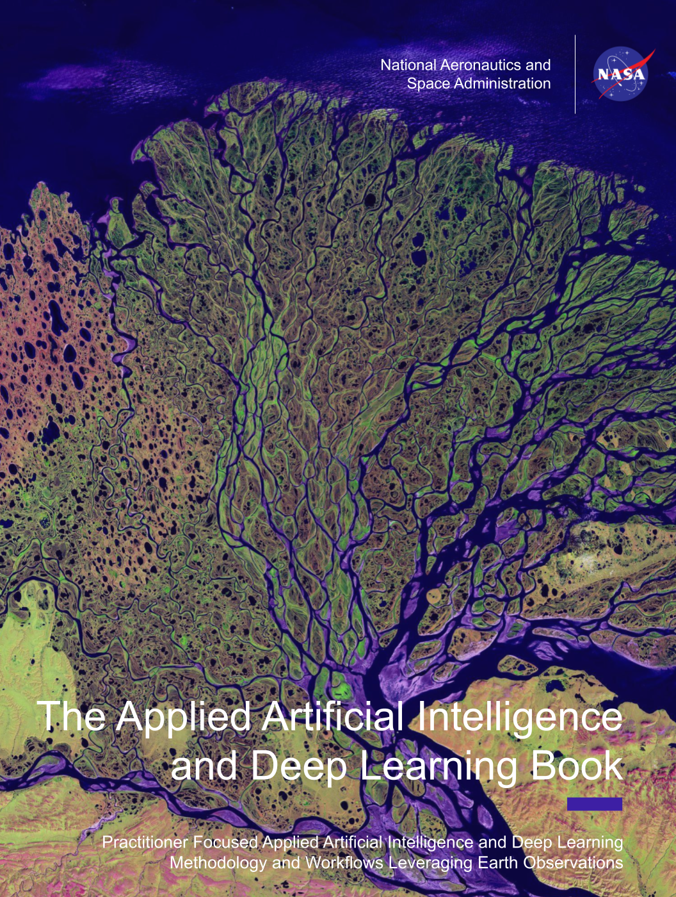

# EarthRISE Applied Artificial Intelligence and Deep Learning Book

[](https://www.python.org/)
[](https://creativecommons.org/licenses/by/4.0/)
[](https://appliedsciences.nasa.gov/what-we-do/capacity-building/develop)

<p align="center">
  
</p>

The NASA EarthRISE program harnesses NASA Earth Action capabilities to deliver trusted solutions for sustained benefits to society. This book provides practitioners with a wide variety of applied examples of Remote Sensing Artificial Intelligence and Deep Learning approaches, with each chapter focusing on a specific problem set and spanning NASA Earth Action thematic areas.

📖 **Read the book:** [nasa-earthrise.github.io/EarthRISE-Applied-Artificial-Intelligence-and-Deep-Learning-Book](https://nasa-earthrise.github.io/EarthRISE-Applied-Artificial-Intelligence-and-Deep-Learning-Book/)

---

## Book Outline

* [Introduction](index.md)
* **2. Data Preparation** *(coming soon)*
* **3. Semantic Segmentation**
  * [3.1 Crop Mapping - Rice Mapping in Bhutan with U-Net](03_Semantic_Segmentation/01__Crop_Mapping/)
  * [3.2 Selective Logging Detection with Very-High Resolution Imagery](03_Semantic_Segmentation/02__Selective_Logging_Detection/)
  * [3.3 Clay Deforestation Segmentation Model](03_Semantic_Segmentation/03__Clay_Deforestation_Segmentation_Model/)
* **4. Object Detection** *(coming soon)*
* **5. Time Series**
  * [5.1 Soybean Yield Prediction](05_Time_Series/01__Soybean_Yield_Prediction/)
* **6. Ecological Process Simulation**
  * [6.1 Active Fire Detection with Bayesian Neural Networks](06_Eco_Process_Sim/01__Active_Fire_Detection/)
* **7. Transfer Learning** *(coming soon)*
* **8. Fusion** *(coming soon)*
* **9. Downscaling** *(coming soon)*
* **10. Future of Deep Learning and Foundation Models**
  * [10.1 Evaluating Foundation Models Trained with Earth Observation Data](10_Future/01__Evaluating_Foundation_Models_Trained_with_Earth_Observation_Data/)
* **11. Ethics** *(coming soon)*
* **12. Conclusions** *(coming soon)*

---

## Building Locally

The book is built with [Quarto](https://quarto.org/). To render locally:

```bash
# Render both HTML and PDF
quarto render

# Preview with live reload
quarto preview

# Render a single chapter
quarto render 03_Semantic_Segmentation/01__Crop_Mapping/notebooks/Rice_Mapping_Bhutan_2021.ipynb
```

For PDF rendering you will also need TinyTeX:

```bash
quarto install tinytex
```

Notebook execution is disabled — chapters render from pre-computed outputs, so no Python environment is required to build the book.

---

## Contributing

See [CONTRIBUTING.md](CONTRIBUTING.md) for folder naming conventions, notebook structure, and how to add a new chapter.

---

## License and Distribution

This book is distributed under the terms of the [CC BY 4.0 License](https://creativecommons.org/licenses/by/4.0/). You are free to share and adapt the material with appropriate attribution.

## Privacy & Terms of Use

This book abides by NASA's privacy and terms of use, available at [nasa.gov/privacy](https://www.nasa.gov/privacy/).

## Citation

[](https://doi.org/10.5281/zenodo.20547797)

> Mayer, T., Bhandari, B., & Saah, D. (2026). EarthRISE Applied Artificial Intelligence and Deep Learning Book. Zenodo. https://doi.org/10.5281/zenodo.20547797

For individual chapter DOIs and BibTeX, see the [How to Cite](https://nasa-earthrise.github.io/EarthRISE-Applied-Artificial-Intelligence-and-Deep-Learning-Book/citing.html) page.
